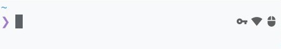
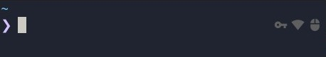

# smart-lock.fish [![ci-status]][ci-link] ![fish-4] ![fish-3] [![sponsors]][sponsor-link] <!-- 0 width spaces on this line -->

> Automatically locks or unlocks the screen based on proximity to trusted devices (Wi-Fi, Bluetooth).

<div align="center">




</div>

## Installation

```fish
fisher install edouard-lopez/smart-lock.fish
```

<details>
<summary>Requirements</summary>

* [Fisher](https://github.com/jorgebucaran/fisher) - Fish plugin manager
* `xprintidle` - X11 idle time detection
* `nmcli` - NetworkManager CLI for Wi-Fi detection (via `network-manager`)
* `bluetoothctl` - Bluetooth device detection (via `bluez` package)
* `cinnamon-screensaver-command` (or modify for your DE)
* `xset`: to manage display power

For Debian/Ubuntu-based systems:  

```
apt install network-manager bluez xprintidle x11-xserver-utils cinnamon-screensaver
```

</details>

**What to do after installation:**

* [ ] Configure the trusted  devices and idle timeout variables ;
* [ ] Run `smart_lock_toggle` periodically (e.g., via cron or systemd timer) ;
* [ ] Display the lock status in your prompt.

## Configuration

### Trusted Devices & Idle Timeout

Set environment variables to define trusted devices and idle timeout.

| Variable                  | Default | Description                                   |
| ------------------------- | ------- | --------------------------------------------- |
| `SMART_LOCK_BSSIDS`       | -       | List of trusted Wi-Fi BSSIDs as MAC addresses<br>e.g. home Wi-Fi, office Wi-Fi |
| `SMART_LOCK_DEVICES_MACS` | -       | List of trusted Bluetooth as MAC addresses<br>e.g. smartphone, mouse)  |
| `SMART_LOCK_AFTER`        | `180`   | Idle timeout in seconds                       |

Example configuration in `config.fish`:

```fish
set --universal SMART_LOCK_BSSIDS "AA:BB:CC:DD:EE:FF" "BB:CC:DD:EE:FF:AA" 
set --universal SMART_LOCK_DEVICES_MACS "CC:DD:EE:FF:AA:BB"
set --universal SMART_LOCK_AFTER 300
```

## Usage

You need to run `smart_lock_toggle` periodically to check the proximity of trusted devices to update `SMART_LOCK_STATUS` and trigger screen lock and unlock the screen accordingly.

### Systemd Timer (Recommended)

Systemd handles environment variables and logging better than `cron`.

#### Create a user-level systemd timer

```fish
mkdir -p ~/.config/systemd/user/
```

#### Edit `~/.config/systemd/user/smart-lock.service`

```ini
[Unit]
Description=Smart Lock Toggle Service

[Service]
Type=oneshot
ExecStart=/usr/bin/fish -c 'source $__fish_config_dir/functions/smart_lock_toggle.fish && smart_lock_toggle'
```

#### Edit `~/.config/systemd/user/smart-lock.timer`

```ini
[Unit]
Description=Smart Lock Toggle Timer

[Timer]
OnBootSec=1min
OnUnitActiveSec=1min
Unit=smart-lock.service

[Install]
WantedBy=timers.target
```

#### Enable and start the timer

```fish
systemctl --user enable --now smart-lock.timer
```

### Crontab

<details>
<summary>If you prefer cron, use the following.</summary>

> :information_source: Note that you may need to set `DISPLAY` and `DBUS_SESSION_BUS_ADDRESS` manually if they are not picked up.

```cron
# give some context to cron jobs
DISPLAY=:0
DBUS_SESSION_BUS_ADDRESS=unix:path=/run/user/$(id -u)/bus 
# run every minute
* * * * * fish -c 'source $__fish_config_dir/functions/smart_lock_toggle.fish && smart_lock_toggle'
```

You can always run it manually

```fish
smart_lock_toggle
```

</details>

### Finally Prompt

Add the following to your prompt to show lock status:

```fish
echo $SMART_LOCK_STATUS
```

:information_source: If you didn't customize your `fish_right_prompt.fish`, you can use our

<details>
<summary>Install our fish_right_prompt</summary>

Backup existing fish_right_prompt.fish

```fish
cp $__fish_config_dir/functions/{,__backup_}fish_right_prompt.fish
```

Replace with smart_lock version

```fish
cp $__fish_config_dir/functions/{__smart_lock_,}fish_right_prompt.fish
```

</details>

[ci-link]: <https://github.com/edouard-lopez/smart-lock.fish/actions> "Github CI"
[ci-status]: https://img.shields.io/github/actions/workflow/status/edouard-lopez/smart-lock.fish/.github/workflows/ci.yml?style=flat-square

[fish-3]: <https://img.shields.io/badge/fish-v3-007EC7.svg?style=flat-square> "Support Fish 3"
[fish-4]: <https://img.shields.io/badge/fish-v4-7dc600.svg?style=flat-square> "Support Fish 4"

[sponsors]: https://img.shields.io/github/sponsors/edouard-lopez?label=💰&style=flat-square "GitHub Sponsors"
[sponsor-link]: https://github.com/sponsors/edouard-lopez/ "Become a sponsor"
