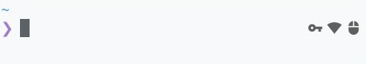
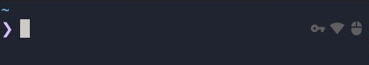

# smart-lock.fish  [![ci-status]][ci-link] [![sponsors]][sponsor-link] [![MIT-img]][MIT]

[ci-link]: <https://github.com/edouard-lopez/smart-lock.fish/actions> "Github CI"
[ci-status]: https://img.shields.io/github/actions/workflow/status/edouard-lopez/smart-lock.fish/.github/workflows/ci.yml?style=flat-square
[sponsors]: https://img.shields.io/github/sponsors/edouard-lopez?label=💖&style=flat-square "GitHub Sponsors"
[sponsor-link]: https://github.com/sponsors/edouard-lopez/ "Become a sponsor"
[MIT]: LICENSE.md "MIT License"
[MIT-img]: https://img.shields.io/badge/license-MIT-blue.svg

> Automatically locks or unlocks the screen based on proximity to trusted devices (Wi-Fi, Bluetooth).

<div align="center">




</div>

## Installation

```fish
fisher install edouard-lopez/smart-lock.fish
```

<details>
<summary>💡 Requirements</summary>

| Tool                                     | Purpose                   | Cinnamon<br>(X11) | KDE/GNOME<br>(Wayland) | KDE/GNOME<br>(X11) | Other<br>(X11) |
| ---------------------------------------- | ------------------------- | ----------------- | ---------------------- | ------------------ | -------------- |
| [`icons-in-terminal`][icons-in-terminal] | nicer icons               | ✓                 | ✓                      | ✓                  | ✓              |
| `nmcli` (via NetworkManager)             | request network status    | ✓                 | ✓                      | ✓                  | ✓              |
| `bluetoothctl`                           | request Bluetooth status  | ✓                 | ✓                      | ✓                  | ✓              |
| `loginctl`                               | control lock/unlock       | ✓                 | ✓                      | ✓                  | ✓              |
| [`xprintidle`][xprintidle]               | get/set idle time         | ✓                 | —                      | ✓                  | ✓              |
| `xset`                                   | get/set X server settings | ✓                 | —                      | ✓                  | ✓              |
| `cinnamon-screensaver-command`           | control lock/unlock       | ✓                 | —                      | —                  | —              |

[icons-in-terminal]: <https://github.com/edouard-lopez/icons-in-terminal>
[xprintidle]: <https://github.com/g0hl1n/xprintidle>

For Debian/Ubuntu-based systems (X11):  

```bash
apt install network-manager bluez xprintidle x11-xserver-utils
```

For Fedora/RHEL-based systems with KDE/GNOME (Wayland):

```bash
dnf install NetworkManager bluez #
```

For Fedora/RHEL-based systems with X11:

```bash
dnf install NetworkManager bluez xorg-x11-server-utils xprintidle
```

</details>

### What to do after installation

* :one::white_check_mark: Configure the trusted  devices and idle timeout variables ;
* :two::white_check_mark: Usage = run `smart_lock_toggle` periodically (e.g., via `systemd` timer or `cron`) ;
* :three::white_check_mark: Display the lock status in your prompt.

## :one::white_check_mark: Configuration

### Trusted Devices & Idle Timeout

Set environment variables to define trusted devices and idle timeout.

| Variable                  | Default | Description                                                                    |
| ------------------------- | ------- | ------------------------------------------------------------------------------ |
| `SMART_LOCK_BSSIDS`       | -       | List of trusted Wi-Fi BSSIDs as MAC addresses<br>e.g. home Wi-Fi, office Wi-Fi |
| `SMART_LOCK_DEVICES_MACS` | -       | List of trusted Bluetooth as MAC addresses<br>e.g. smartphone, mouse)          |
| `SMART_LOCK_AFTER`        | `180`   | Idle timeout in seconds                                                        |

Example configuration in `config.fish`:

```fish
set --universal --export SMART_LOCK_BSSIDS "AA:BB:CC:DD:EE:FF" "BB:CC:DD:EE:FF:AA" 
set --universal --export SMART_LOCK_DEVICES_MACS "CC:DD:EE:FF:AA:BB"
set --universal --export SMART_LOCK_AFTER 300
```

## :two::white_check_mark: Usage = run periodically

You need to run `smart_lock_toggle` periodically to check the proximity of trusted devices to update `SMART_LOCK_STATUS` and trigger screen lock and unlock the screen accordingly.

### `systemd` Timer (Recommended)

Systemd handles environment variables and logging better than `cron`.

<details>
<summary>Create <code>systemd</code> service and timer</summary>

#### Create a user-level systemd timer

```fish
mkdir -p ~/.config/systemd/user/
```

#### Edit `~/.config/systemd/user/smart-lock.service`

```ini
[Unit]
Description=Smart Lock Toggle Service

[Service]
Type=oneshot
ExecStart=/usr/bin/fish -c 'source $__fish_config_dir/functions/smart_lock_toggle.fish && smart_lock_toggle'
```

#### Edit `~/.config/systemd/user/smart-lock.timer`

```ini
[Unit]
Description=Smart Lock Toggle Timer

[Timer]
OnBootSec=1min
OnUnitActiveSec=1min
Unit=smart-lock.service

[Install]
WantedBy=timers.target
```

#### Enable and start the timer

```fish
systemctl --user enable --now smart-lock.timer
```

</details>

### Crontab

<details>
<summary>If you prefer cron, use the following.</summary>

> :information_source: Note that you may need to set `DISPLAY` and `DBUS_SESSION_BUS_ADDRESS` manually if they are not picked up.

```cron
# give some context to cron jobs
DISPLAY=:0
DBUS_SESSION_BUS_ADDRESS=unix:path=/run/user/$(id -u)/bus 
# run every minute
* * * * * fish -c 'source $__fish_config_dir/functions/smart_lock_toggle.fish && smart_lock_toggle'
```

</details>

## :three::white_check_mark: Finally Prompt

Add the following to your prompt to show lock status:

```fish
echo $SMART_LOCK_STATUS
```

:information_source: If you didn't customize your `fish_right_prompt.fish`, you can use ours:
<details>
<summary><b>💡 Install our fish_right_prompt</b></summary>

1. Backup existing `fish_right_prompt.fish`:

    ```fish
    cp $__fish_config_dir/functions/{,__backup_}fish_right_prompt.fish
    ```

2. Replace with `smart_lock`'s version:

    ```fish
    cp $__fish_config_dir/functions/{__smart_lock_,}fish_right_prompt.fish
    ```

</details>

## Debugging

You can always run it manually with Fish debugging

```fish
set fish_trace 1
smart_lock_toggle
set --erase fish_trace
```
